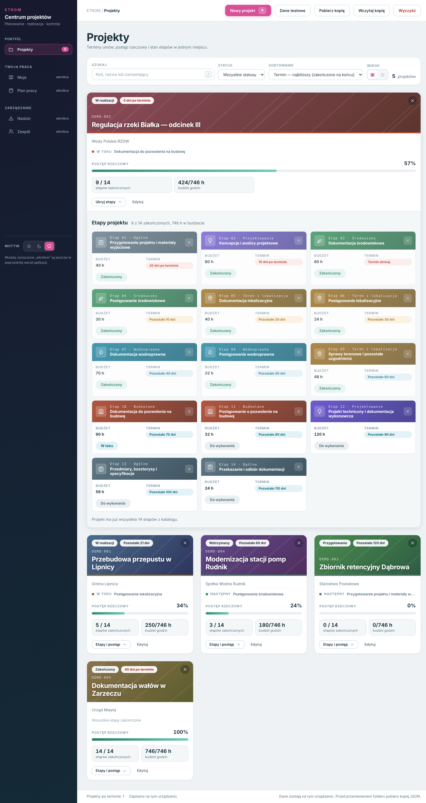

# ETROM — wersja 2

Aplikacja do prowadzenia projektów, etapów i terminów. Działa lokalnie,
**bez instalacji i bez serwera** — wystarczy dwuklik na `index.html`.



## Uruchomienie

1. Pobierz i rozpakuj **cały** folder.
2. Kliknij dwukrotnie `index.html`.

To wszystko. Nie trzeba Node.js, npm ani niczego instalować.
Jeśli wolisz adres `http://`, działa też przez dowolny serwer statyczny,
na przykład `python -m http.server 8000`.

Pierwsze uruchomienie jest puste. Przycisk **Dane testowe** dopisuje pięć
przykładowych projektów, żeby było na czym sprawdzić listę, etapy i postęp.

## Co już działa

- lista projektów w kartach, z postępem rzeczowym liczonym **wagą godzin etapów**,
- dodawanie, edycja i usuwanie projektu, z walidacją przy polach
  (kod projektu musi być niepowtarzalny),
- 14 standardowych etapów z kolorami dziedzin; dokładanie i usuwanie etapów,
- status etapu przełączany kliknięciem: *Do wykonania → W toku → Zakończony*,
- terminy z opisem stanu: *po terminie*, *termin dzisiaj*, *pozostało N dni*,
- szukanie po kodzie, nazwie i zamawiającym; filtr statusu; cztery sortowania,
- zapis lokalny w przeglądarce (`localStorage`) oraz pobieranie i wczytywanie kopii JSON,
- automatyczny odczyt danych ze starszej wersji ETROM (klucz `etrom.workspace.v2`) —
  stary zapis zostaje nietknięty,
- widok kart i gęsty widok listy z sortowaniem po kolumnach,
- motyw jasny, ciemny albo zgodny z systemem — wybór zostaje na urządzeniu,
- obsługa klawiatury: `N` nowy projekt, `/` skok do wyszukiwarki, `Esc` zamyka panel,
- formularz w panelu wysuwanym, potwierdzenia we własnych oknach aplikacji.

## Czego jeszcze nie ma

Zadania wewnątrz etapów, Kroki, zespół i role, ewidencja czasu pracy, Nadzór,
Plan pracy, Kanban i Gantt. To kolejne kroki przebudowy — poprzednia wersja
aplikacji ma je i zostaje nienaruszona do czasu, aż nowa je dogoni.

## Układ plików

```
index.html              jedyny plik do otwarcia
styles/
  tokens.css            kolory, odstępy, typografia — jedno źródło prawdy
  app.css               komponenty i układ
src/core/               logika, zero kodu dotykającego DOM
  catalog.js            14 etapów i dziedziny
  model.js              fabryki i walidacja
  progress.js           postęp i terminy
  query.js              szukanie, filtrowanie, sortowanie
  storage.js            zapis lokalny i odczyt starej wersji
  store.js              pojemnik na stan
src/ui/                 warstwa widoku
  dom.js                budowanie elementów
  stageList.js          lista etapów
  projectCard.js        karta projektu
  projectForm.js        formularz
  app.js                spięcie całości
tests/                  testy logiki (Node) i test przeglądarki
tools/screenshot.js     zrzuty ekranu obu motywów
```

Podział jest celowy: w `src/core` nie ma ani jednego odwołania do DOM, więc
liczenie postępu, terminów i walidację da się przetestować bez przeglądarki.
Widok tylko czyta stan i rysuje.

## Testy

```bash
node --test tests/*.test.js     # 81 testów logiki, bez przeglądarki
node tests/browser/smoke.js     # 27 sprawdzeń w Chromium, na adresie file://
node tools/screenshot.js        # zrzuty ekranu do docs/screenshots
```

Testy nie mają żadnych zależności z npm — korzystają z wbudowanego
`node:test` i protokołu DevTools. Test przeglądarkowy uruchamia aplikację
dokładnie tak, jak robi to dwuklik z dysku, więc sprawdza także to,
czy zapis lokalny działa na `file://`.

Wymagany Node.js 22 lub nowszy — **tylko do testów**, nie do działania aplikacji.

## Decyzje techniczne

**Dlaczego klasyczne skrypty, a nie moduły ES ani framework?**
Aplikacja ma działać po dwukliku z rozpakowanego folderu. Moduły ES
(`<script type="module">`) nie wczytują się z adresu `file://`, bo przeglądarka
blokuje je regułami CORS. Framework taki jak React wymagałby kroku budowania,
czyli instalacji Node.js po stronie użytkownika. Dlatego pliki ładują się jako
zwykłe skrypty i wystawiają się w jednej przestrzeni nazw `window.ETROM`,
z zabezpieczeniem pozwalającym wczytać je też w Node do testów.

**Dlaczego elementy budowane są przez DOM, a nie przez sklejanie HTML?**
Nazwa projektu wpisana przez użytkownika nigdy nie trafia do `innerHTML`.
Znika przez to cała klasa błędów z escapowaniem — jest na to test.

**Skąd biorą się kolory okładek projektów?**
Barwa jest wyliczana z kodu projektu (`src/core/identity.js`), więc ten sam
projekt zawsze wygląda tak samo, a sąsiednie kody dostają odległe odcienie.
Warstwice na okładce nawiązują do map terenu — to język tej branży.
Paleta marki (malinowy akcent, mięta, granatowy pasek) jest przeniesiona
z poprzedniej wersji aplikacji, nie wymyślona od nowa.

**Dlaczego własne okna zamiast `confirm()` przeglądarki?**
Systemowe okienko z napisem „localhost mówi” wygląda jak awaria, a nie jak
część programu. Potwierdzenia i panel formularza korzystają z natywnego
`<dialog>`, więc uwięzienie fokusa i zamykanie Escapem działają bez
dopisywania własnej obsługi, a wygląd jest w całości nasz.

**Dlaczego ruch pojawia się tylko miejscami?**
Aplikacja przerysowuje listę przy każdej zmianie, więc animacja wejścia
na każdym elemencie włączałaby się także przy wpisywaniu w wyszukiwarkę.
Zamiast tego pamiętany jest poprzedni stan i ruch pokazuje wyłącznie to,
co naprawdę się zmieniło: pasek postępu przechodzi ze starej wartości,
zmieniony etap błyska, lista etapów wsuwa się przy rozwinięciu.
Wszystko ustępuje przy włączonym ograniczeniu ruchu w systemie.

**Dlaczego nie ma webfontu?**
Aplikacja musi działać z dysku, bez sieci. Pobierany krój by się nie wczytał,
więc charakter buduje skala, grubość i światło, a nie plik z serwera.

**Dlaczego sortowanie po terminie odsuwa projekty zakończone?**
Projekt zamknięty nie ma już czynnego terminu, a przy sortowaniu po dacie
potrafił zająć czoło listy datą sprzed wielu tygodni. Wyszło to dopiero
w teście przeglądarkowym.
