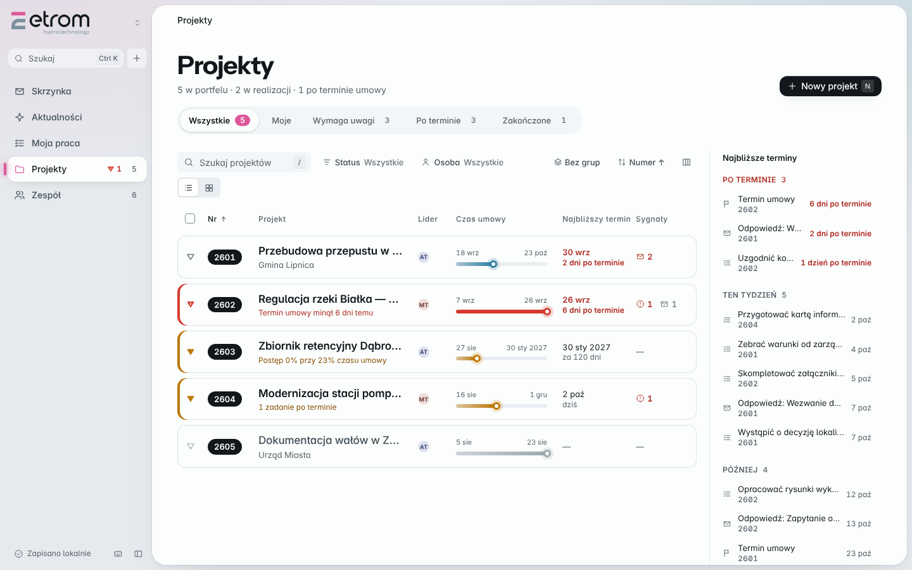
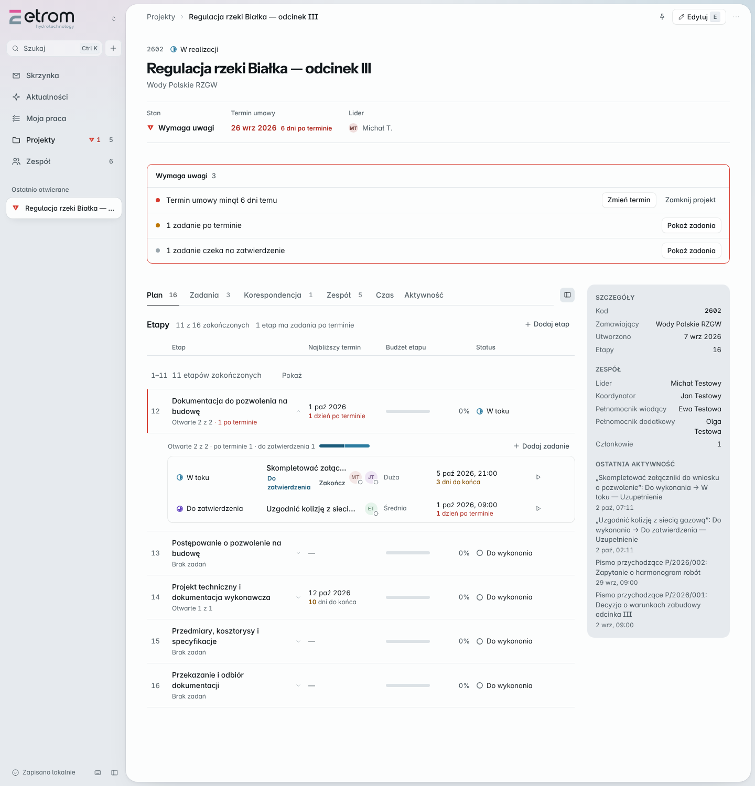
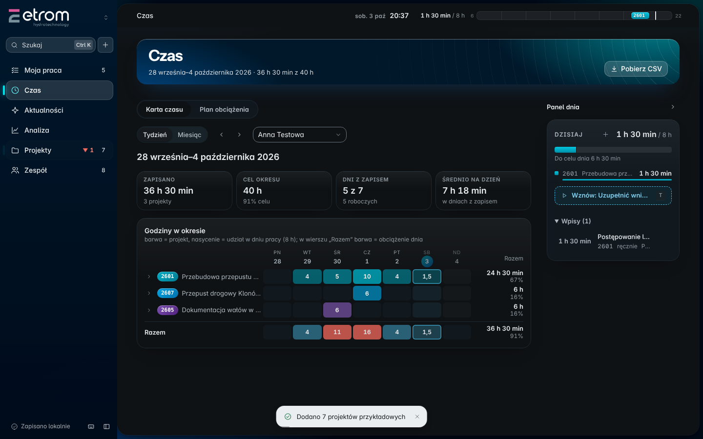

# ETROM — wersja 2

Aplikacja do prowadzenia projektów, etapów i terminów. Działa lokalnie,
**bez instalacji i bez serwera** — wystarczy dwuklik na `index.html`.

Interfejs mówi własnym językiem — rzędna ▽ stanów wód, profil przebiegu etapów,
tusz i kalka rysunku technicznego — opisanym w **[kierunku artystycznym](docs/ART_DIRECTION.md)**.
Zasady stosowania: **[UI/UX Standard v2.3](docs/DESIGN_SYSTEM.md)**, obowiązujący
dla każdego kolejnego ekranu i każdej nowej funkcji.







## Uruchomienie

1. Pobierz i rozpakuj **cały** folder.
2. Kliknij dwukrotnie `index.html`.

To wszystko. Nie trzeba Node.js, npm ani niczego instalować.
Jeśli wolisz adres `http://`, działa też przez dowolny serwer statyczny,
na przykład `python -m http.server 8000`.

Pierwsze uruchomienie jest puste. Przycisk **Dodaj dane przykładowe** dopisuje siedem
projektów z etapami, ponad 30 zadaniami (po terminie, na dziś, do poprawy, ukończone), ośmioma
osobami ze stawkami godzinowymi, ok. 450 wpisami czasu pracy, korektami godzin zarządu,
korespondencją i wpisami w Aktualnościach (ankiety, wyróżnienia, zdjęcia, komentarze, reakcje).
Ponowne wczytanie niczego nie dubluje — dopisuje tylko brakujące rzeczy.
Później ta sama czynność, kopia zapasowa i usuwanie danych są w menu
**Ustawienia i dane** na dole panelu bocznego.

## Co już działa

- **portfel projektów**: zakładki widoków (Wszystkie, Moje, Wymaga uwagi, Po terminie, Zakończone i własne — zapisywane) z licznikami, pasek stanu, tabela grupowana „Wymaga uwagi / W normie / Zakończone” (postęp wobec planu, najbliższy termin, sygnały, lider zmieniany w komórce) albo karty, panel najbliższych terminów (zadania, odpowiedzi na pisma, terminy umów); gęstość Komfortowa/Zwarta w ustawieniach,
- **stan projektu** w skali stanów wód (w normie, ostrzegawczy, alarmowy) liczony z terminów
  i z opóźnienia pracy wobec upływu czasu umowy — zawsze z powodem w słowach,
- **profil przebiegu**: etapy jako odcinki proporcjonalne do budżetu godzin — długość wykreślonej
  linii jest postępem rzeczowym; linijka czasu umowy pod nim pokazuje opóźnienie bez liczb,
- lista projektów w tabeli (domyślnie, pogrupowana według stanu) albo w kartach,
- **przestrzeń projektu pod własnym adresem** (`#/projekty/12`) z zakładkami Plan, Zadania,
  Korespondencja, Zespół, Czas, Aktywność — działa przycisk Wstecz i link do konkretnego projektu,
- **inspektor**: podgląd zadania (z historią zmian statusu), osoby (obciążenie, funkcje, zadania)
  i projektu (Spacja na wierszu) bez opuszczania bieżącego widoku,
- **zespół z obciążeniem**: otwarte zadania każdej osoby i jej funkcje w projektach; zarząd widzi dodatkowo obciążenie w procentach (średnia godzin z 4 tygodni wobec 40 h, pasek i godziny; przeciążenie, pełne obłożenie, wolna przepustowość),
- panel boczny zwijany klawiszem `[`, projekty przypięte i ostatnio otwierane,
- dodawanie, edycja i usuwanie projektu, z walidacją przy polach
  (kod projektu musi być niepowtarzalny),
- 16 standardowych etapów jako **szablon do wyboru** — projekt bierze tylko te, które go dotyczą,
- **etapy spoza standardu** z własną nazwą, dziedziną, budżetem i terminem,
- kolejność etapów ustawiana w projekcie, więc własny etap może stanąć pomiędzy standardowymi,
- status etapu przełączany kliknięciem: *Do wykonania → W toku → Zakończony*,
- **zegar rejestracji czasu**: ▶ przy zadaniu (włącza je w toku, zatrzymuje poprzedni zegar osoby), pływający zegar w pasku górnym, wpis ręczny, korekta zapomnianego zegara, czas zapisany dziś w *Mojej pracy*, zużycie budżetu godzin przy etapie; dane jako dopisywane rekordy gotowe pod wspólną bazę (`docs/MULTIUSER.md`),
- terminy z opisem stanu: *po terminie*, *termin dzisiaj*, *pozostało N dni*; termin projektu zawsze z rokiem i licznikiem dni do końca,
- **Stan projektu jest wyjaśniony**: klik w znacznik stanu (lista, karta, nagłówek projektu) otwiera kartę z powodami i akcjami (Zmień termin, Pokaż zadania, Otwórz korespondencję…) oraz miernikami z progami także dla „W normie”. Pismo po terminie obniża stan do ostrzegawczego (spójnie z listą terminów). Nagłówki radaru „Najbliższe terminy” (Po terminie / Ten tydzień / Później) filtrują listę projektów.
- **Moja praca** (`#/moja-praca`, skrót `G M`) — jedno miejsce na „co mam zrobić”: sekcja **Wymaga reakcji** (zadania do zatwierdzenia i pisma z terminem odpowiedzi do 3 dni naprzód lub po terminie; pozycje znikają same po załatwieniu sprawy, można je odłożyć do jutra), pasek **projektów w alarmie** dla liderów, potem własne zadania według czasu (po terminie, dziś, w tym tygodniu…). Pismo ma jednego właściciela naraz: bez zadania jest w reakcjach (od razu po wpisaniu), z otwartym zadaniem prowadzi je zadanie, po zakończeniu zadania bez odpowiedzi wraca z prośbą o rejestrację odpowiedzi. Objaśnienia („dlaczego to widzę”) są w dymkach po najechaniu. Jeden licznik w pasku bocznym. Dawna osobna Skrzynka została scalona; link `#/skrzynka` otwiera Moją pracę. Logika w `core/inbox.js`, sekcja w `ui/inboxScreen.js`.
- **Aktualności** (`#/aktualnosci`, skrót `G A`): strumień w stylu mediów społecznościowych — karty ze zmianami statusu zadań (z autorem i powodem zwrotu), pismami, czasem pracy i nowymi projektami oraz wpisami ludzi. Pasek projektów z pierścieniem stanu (alarm / uwaga / w normie), kompozytor wpisu (dla całego biura albo projektu, `Ctrl+Enter`), cztery reakcje, komentarze w karcie, zakładki Wszystko / Moje / Zdarzenia / Pisma / Wpisy, separatory dni i „Pokaż starsze”. Cudzy czas pracy widzi tylko lider projektu i zarząd; autor i zarząd mogą usuwać wpisy i komentarze. **Zdarzenia projektowe** generuje aplikacja (etap zakończony z następnym etapem, przejście projektu w stan ostrzegawczy / alarmowy / powrót do normy z powodem, zamknięcie, wstrzymanie i wznowienie), z kontekstem „2601 → Etap”; zmiany stanu wykrywane są też między sesjami (zapamiętany poziom). Logika w `core/feed.js`, `core/social.js` i `core/events.js`.
- **Plan projektu**: tabela etapów (etap · najbliższy termin · budżet etapu · status). Zużycie etapu to suma czasu całego zespołu plus korekty zarządu. Lider i zarząd widzą godziny („47,5 / 90 h”), pozostali tylko procent zużycia budżetu; zarząd może dodać sztuczną korektę zużycia w formularzu etapu (`core/budget.js`). Postęp i podział na rodzaje trafią do osobnej zakładki „Analiza”.
- **Numery projektów** wg roku: `RRNN` (2601, 2602…), kolejny proponuje formularz; lista domyślnie po numerze rosnąco (klik w nagłówek odwraca).
- **Moja praca** (`#/moja-praca`, skrót `G M`; zakładki Wszystko / Dziś / Ten tydzień / Do decyzji / Do poprawy, `J`/`K` po wierszach): zadania wybranej osoby w przedziałach czasu (po terminie, dziś, tydzień, później), zadania do zatwierdzenia dla lidera i koordynatora, zwroty do poprawy i moje projekty; kim jest osoba przy urządzeniu, zapamiętuje preferencja „ja”,
- szukanie po kodzie, nazwie i zamawiającym; filtry statusu i osoby; cztery sortowania,
- tabela z przyklejonym nagłówkiem, sortowaniem z nagłówka, wyborem kolumn,
  zaznaczaniem wierszy i **akcjami zbiorczymi** (zmiana statusu, usunięcie z cofnięciem),
- zapis lokalny w przeglądarce (`localStorage`) oraz pobieranie i wczytywanie kopii JSON,
- automatyczny odczyt danych ze starszej wersji ETROM (klucz `etrom.workspace.v2`) —
  stary zapis zostaje nietknięty,
- motyw jasny, ciemny albo zgodny z systemem — wybór zostaje na urządzeniu,
- paleta poleceń pod `Ctrl+K`: skok do projektu po fragmencie nazwy albo uruchomienie działania,
- obsługa klawiatury: `N` nowy projekt lub osoba, `E` edycja projektu, `/` wyszukiwarka,
  `Esc` zamyka menu i panel, `Ctrl+Enter` zapisuje formularz, strzałki w menu,
- usuwanie działa od razu i przez kilka sekund da się je cofnąć,
- dwa warianty koloru pracy w toku (nurt, grafit) obok motywu jasnego i ciemnego,
- **ekran Zespołu**: katalog osób, role w organizacji, forma współpracy,
  wyłączanie z obiegu z zachowaniem historii,
- **funkcje w projekcie**: Lider, Koordynator, Pełnomocnik wiodący i dodatkowy
  oraz pozostali członkowie zespołu — relacje oparte o stabilny identyfikator osoby,
- awatary zespołu na kartach i w liście projektów, filtr projektów po osobie,
- **zadania w etapach**: nazwa, termin z godziną, nakład pracy, opis, znacznik ważności,
- przepływ statusów zadania: *Do wykonania → W toku → Do zatwierdzenia → Zakończone*,
  ze zwrotem **Do poprawy**, który wymaga podania powodu,
- **realizatorzy zadania** to jawny podzbiór zespołu projektu; każdy ma własny stan udziału
  (*Do wykonania / W toku / Gotowe*) przestawiany jednym kliknięciem,
- liczniki zadań otwartych i po terminie w wierszu etapu oraz na karcie projektu,
- formularze w panelu wysuwanym, potwierdzenia we własnych oknach aplikacji,
- układ dopasowany do szerokości: pełny na monitorze, uproszczony na laptopie,
  z wysuwanym panelem bocznym na telefonie.

## Świadome uproszczenia wobec poprzedniej wersji

Poprzedni ETROM miał w przepływie zadania osobny status **Zatwierdzone**
obok **Zakończone**. W jego własnej mapie przejść oba prowadziły w to samo
miejsce, więc tutaj jest jeden stan końcowy. Jeśli rozróżnienie okaże się
potrzebne w pracy biura, wraca jako jeden wpis w mapie przejść.

Nie ma jeszcze **Kroków** — wydzielonych czynności jednej osoby wewnątrz
zadania. Ich rolę częściowo pełni stan udziału każdego realizatora.

## Czego jeszcze nie ma

Kroki wewnątrz zadań, ewidencja czasu pracy, Nadzór, Plan pracy, moduł Moje,
Kanban i Gantt. To kolejne kroki przebudowy — poprzednia wersja aplikacji
ma je i zostaje nienaruszona do czasu, aż nowa je dogoni.

## Układ plików

```
index.html              jedyny plik do otwarcia
styles/
  fonts.css             osadzone kroje (generuje tools/build-fonts.py)
  tokens.css            barwy, typografia, odstępy, promienie, warstwy, ruch — jedno źródło prawdy
  base.css              reset, role typograficzne, fokus
  components.css        komponenty bazowe (przyciski, pola, menu, tabela, okna…)
  signature.css         rzędna ▽ i oś etapów
  flow.css              ETROM Flow System: miernik, tor, poziom, znacznik
  layout.css            szkielet: panel boczny, pasek górny, strona, szerokości
  views.css             układ treści konkretnych ekranów
docs/
  ART_DIRECTION.md      język wizualny ETROM i jego uzasadnienie
  DESIGN_SYSTEM.md      UI/UX Standard v2.3 — obowiązujące zasady interfejsu
  licenses/             licencje osadzonych krojów (SIL OFL 1.1)
  UI_AUDIT.md           audyt interfejsu przed przebudową
src/core/               logika, zero kodu dotykającego DOM
  catalog.js            16 etapów, tematy i rodzaje pracy
  team.js               katalog osób i funkcje w projektach
  tasks.js              zadania, przepływ statusów i udziały realizatorów
  model.js              fabryki i walidacja
  progress.js           postęp i terminy
  query.js              szukanie, filtrowanie, sortowanie
  storage.js            zapis lokalny i odczyt starej wersji
  store.js              pojemnik na stan
  format.js             daty, liczby i polska odmiana przez liczby
  mail.js               dziennik korespondencji: numeracja, terminy odpowiedzi, wątki
  events.js             zdarzenia projektowe do Aktualności (wykrywanie zmian)
  insight.js            stan projektu, profil, harmonogram, portfel, obciążenie osób
src/ui/                 warstwa widoku
  dom.js                budowanie elementów, przerysowanie z zachowaniem fokusu
  icons.js              jeden zestaw ikon
  components.js         komponenty bazowe (ETROM.UI)
  signature.js          rzędna ▽ (ETROM.Sig)
  flowSystem.js         ETROM Flow System: PlanBar, Flow, Verdict, Level, Marker (ETROM.Flow)
  inspector.js          inspektor: zadanie, osoba, projekt
  menu.js, tooltip.js   menu rozwijane, popover, podpowiedzi
  dialog.js, toast.js   okna, panel boczny, powiadomienia
  shell.js              panel boczny, ścieżka, ustawienia
  projectList.js        tabela i karty projektów
  projectDetail.js      szczegóły projektu z zakładkami
  stageList.js          etapy
  taskList.js           zadania
  mailTab.js            zakładka Korespondencja i formularz pisma
  teamScreen.js         ekran Zespołu
  myWork.js             ekran Moja praca
  inboxScreen.js        sekcja „Wymaga reakcji” w Mojej pracy
  feedScreen.js         ekran Aktualności
  timer.js              zegar, lista czasu i formularz wpisu
  *Form.js              formularze w panelu bocznym
  app.js                stan, adresy, działania, rysowanie
tests/                  testy logiki (Node) i test przeglądarki
tools/build-logo.py      logo → styles/logo.css
tools/screenshot.js     zrzuty ekranu obu motywów
```

Podział jest celowy: w `src/core` nie ma ani jednego odwołania do DOM, więc
liczenie postępu, terminów i walidację da się przetestować bez przeglądarki.
Widok tylko czyta stan i rysuje.

## Testy

```bash
node --test tests/*.test.js     # 302 testy logiki i kontrastu barw, bez przeglądarki
node tests/browser/smoke.js     # 294 sprawdzeń w Chromium, na adresie file://, z prawdziwą klawiaturą
node tools/screenshot.js        # zrzuty: ekrany, motywy, 1440/1024/390 px, menu, panel, inspektor, 10 przypadków skrajnych miernika
```

Testy nie mają żadnych zależności z npm — korzystają z wbudowanego
`node:test` i protokołu DevTools. Test przeglądarkowy uruchamia aplikację
dokładnie tak, jak robi to dwuklik z dysku, więc sprawdza także to,
czy zapis lokalny działa na `file://`.

Wymagany Node.js 22 lub nowszy — **tylko do testów**, nie do działania aplikacji.

## Decyzje techniczne

**Dlaczego klasyczne skrypty, a nie moduły ES ani framework?**
Aplikacja ma działać po dwukliku z rozpakowanego folderu. Moduły ES
(`<script type="module">`) nie wczytują się z adresu `file://`, bo przeglądarka
blokuje je regułami CORS. Framework taki jak React wymagałby kroku budowania,
czyli instalacji Node.js po stronie użytkownika. Dlatego pliki ładują się jako
zwykłe skrypty i wystawiają się w jednej przestrzeni nazw `window.ETROM`,
z zabezpieczeniem pozwalającym wczytać je też w Node do testów.

**Dlaczego elementy budowane są przez DOM, a nie przez sklejanie HTML?**
Nazwa projektu wpisana przez użytkownika nigdy nie trafia do `innerHTML`.
Znika przez to cała klasa błędów z escapowaniem — jest na to test.

**Dlaczego interfejs jest prawie bez koloru?**
Kolor ma w ETROM dwa zadania: pokazać to, co dzieje się teraz (nurt),
i to, co jest zagrożone (bursztyn, czerwień). Wszystko inne jest pisane tuszem.
Dzięki temu kolor znaczy coś za każdym razem, gdy się pojawia — w portfelu
z kilkudziesięcioma projektami problem widać, zanim przeczyta się choć słowo.

**Skąd trójkąt ▽ i stany „ostrzegawczy”, „alarmowy”?**
To język hydrologii, w którym pracuje biuro: rzędna na przekroju i stany wód.
Zdrowie projektu opisane tymi samymi słowami czyta się bez legendy.

**Dlaczego własne okna zamiast `confirm()` przeglądarki?**
Systemowe okienko z napisem „localhost mówi” wygląda jak awaria, a nie jak
część programu. Potwierdzenia i panel formularza korzystają z natywnego
`<dialog>`, więc uwięzienie fokusa i zamykanie Escapem działają bez
dopisywania własnej obsługi, a wygląd jest w całości nasz.

**Dlaczego „Cofnij” zamiast „czy na pewno”?**
Pytanie przed każdym usunięciem spowalnia pracę, a i tak klika się je
odruchowo. Usunięcie wykonuje się od razu, a pasek na dole pozwala je
odwołać przez kilka sekund — to ratuje również pomyłki, które zostałyby
potwierdzone bez czytania. Okno potwierdzenia zostało tam, gdzie znika
wszystko naraz: przy czyszczeniu danych programu.

**Dlaczego przejścia widoku tylko przy zmianie ekranu?**
`startViewTransition` odkłada zmianę o klatkę i na czas przejścia zamraża
stronę. Przy zmianie ekranu i układu to się opłaca — widać, skąd przyszła
nowa treść. Przy rozwijaniu etapu czy zmianie statusu nie: tam reakcja
ma być natychmiastowa.

**Dlaczego szczegóły projektu to osobny ekran, a nie rozwinięta karta?**
Rozwinięta karta mieściła portfel, projekt, czternaście etapów i ich zadania
w jednym przewijanym ekranie. Nie dało się do projektu wrócić linkiem, a lista
przestawała być listą. Teraz lista służy porównaniu projektów, a szczegóły —
pracy w jednym projekcie, z adresem, który działa z przyciskiem Wstecz.

**Dlaczego status zadania zmienia się z menu, a nie dowolnie?**
Dozwolone przejścia są w modelu (`src/core/tasks.js`), a menu pokazuje
tylko te, które wolno wykonać z bieżącego stanu. Interfejs nie zna reguł
przepływu — pyta o nie model, więc nie da się obejść ich klikaniem.
Zwrot do poprawy bez powodu jest odrzucany przez model, nie przez formularz.

**Dlaczego funkcje w projekcie wskazują na identyfikator, a nie na imię?**
Wpisane imię i nazwisko rozjeżdża się przy pierwszej literówce i przy zmianie
nazwiska. Funkcja jest relacją `osoba ↔ projekt` opartą o stabilne `id`, więc
zmiana danych osoby nie gubi jej przypisań. Dwa pełnomocnictwa to niezależne
sloty, a osoba pełniąca funkcję należy do zespołu z urzędu.

**Dlaczego osoby się nie usuwa, tylko wyłącza?**
Usunięcie zerwałoby historię projektów, w których ktoś pracował. Osobę
z przypisaniami da się tylko wyłączyć z obiegu — znika z list wyboru,
ale zostaje w projektach. Wyłączenie jest blokowane, dopóki pełni funkcję
w niezakończonym projekcie. Usunąć wprost można tylko osobę bez żadnych
przypisań.

**Skąd numery etapów, skoro projekt nie ma wszystkich czternastu?**
Na kafelku jest numer kolejny w tym projekcie, żeby lista nie miała dziur,
a przynależność do standardu stoi w podpisie („Wodnoprawne · standard 07”).
Dzięki temu lista czyta się ciągle, a wspólny język biura zostaje.
Etap dopisany w projekcie ma w podpisie „własny”.

**Dlaczego lista etapów jest tak oszczędna w kolorze?**
Wcześniej każdy etap miał duży nagłówek w kolorze dziedziny — czternaście
plam konkurujących o uwagę. Dziedzina to klasyfikacja, nie powód do
reakcji, więc została po niej tylko mała ikona. Ciężar wizualny przejął
stan — ikona o kształcie stanu i nazwa; zakończony etap jest wyciszony. Kolor terminu pojawia się wyłącznie przy przekroczeniu lub
tygodniu zapasu — bursztyn dla miesięcznego zapasu w czternastu wierszach
był szumem, nie informacją.

**Dlaczego status ma ikonę o kształcie, a nie tylko kolor?**
Osoba z zaburzeniami widzenia barw nie odróżni „W toku” od „Do zatwierdzenia”
po samym kolorze plakietki. Każdy stan ma własny kształt (puste koło, półkole,
trzy czwarte, ptaszek…), więc da się go odczytać nawet na wydruku czarno-białym.

**Dlaczego ruch pojawia się tylko miejscami?**
Aplikacja przerysowuje listę przy każdej zmianie, więc animacja wejścia
na każdym elemencie włączałaby się także przy wpisywaniu w wyszukiwarkę.
Zamiast tego pamiętany jest poprzedni stan i ruch pokazuje wyłącznie to,
co naprawdę się zmieniło: pasek postępu przechodzi ze starej wartości,
zmieniony etap lub zadanie na chwilę się podświetla.
Wszystko ustępuje przy włączonym ograniczeniu ruchu w systemie.

**Jak kroje działają bez sieci?**
Są osadzone w `styles/fonts.css` jako dane (podzbiór liter łacińskich z polskimi
znakami), więc wczytują się z dysku razem z aplikacją. Dzięki temu ETROM wygląda
tak samo na każdym komputerze. Oba kroje mają licencję SIL OFL 1.1.

**Dlaczego sortowanie po terminie odsuwa projekty zakończone?**
Projekt zamknięty nie ma już czynnego terminu, a przy sortowaniu po dacie
potrafił zająć czoło listy datą sprzed wielu tygodni. Wyszło to dopiero
w teście przeglądarkowym.


## Zegar — czytelność czasu

- Pasek zegara pokazuje „od HH:MM”; komunikaty: „Zegar włączony o …”, „Zakończono o … (start …)”.
- Moja praca: oś dnia (odcinki w barwach projektów, znacznik „teraz”, start dnia i ostatni koniec).
- Kokpit portfela: „Teraz w pracy” (chodzące zegary) oraz łączenie terminów tego samego projektu z tego samego dnia.

## Audyt widoku projektu (powtórzenia)

- Nagłówek: termin umowy jest w torze czasu i w stanie projektu, więc fakt „Termin umowy” zastąpił „Zapisany czas”; liczba etapów nie powtarza się w faktach.
- Flow: etap z zadaniami po terminie ma kropkę alarmu na torze.
- Zegar: „Wznów ostatnie” w Mojej pracy i skrót klawiszowy T (zatrzymaj / wznów).

## Project Workspace — Project Intelligence Pass

- **Nagłówek projektu:** jeden rząd właściwości (Stan, Postęp z kreską planu, Termin umowy edytowany w miejscu, Godziny, Lider) i lista „Wymaga uwagi” z przyciskami działań; klik w postęp → „Plan i odchylenia”.
- **Plan i odchylenia** (`Insight.variance`): postęp (pp), godziny zapisane vs oczekiwane na dziś (h), termin umowny vs prognoza liniowa (dni). Brak danych = brak liczby i jawny powód (nic nie jest zgadywane); prognoza dopiero przy ≥ 7 dniach pracy i ≥ 5% postępu.
- **Wymaga uwagi** (`Insight.attentionItems`): powody stanu, zaległe pisma, etap bez zadań, zadania bez osoby i czekające na zatwierdzenie — każde z działaniem.
- **Najbliższa akcja** (`Insight.nextAction`): zwrócone → zaległe → do zatwierdzenia → bez realizatora → termin ≤ 14 dni; inaczej „Brak działań wymagających uwagi”.
- **Kanban zadań** (Zadania → Lista | Kanban): pięć kolumn (Do wykonania, W toku, Do zatwierdzenia, Do poprawy, Zakończone — ostatnie 30 dni), przeciąganie kart z kontrolą dozwolonych przejść (zwrot do poprawy pyta o powód), szybkie kroki na karcie, filtry Etap / Osoba / Tylko moje, grupowanie etapami; logika w `src/core/board.js`.
- **Skróty:** `?` pokazuje pełną listę; J/K — po projektach na liście, V — widok tabela↔karty i lista↔kanban.
- Szczegóły projektu nie mają bocznego panelu: dane są w nagłówku, a zespół i aktywność w zakładkach.
- **Aktywny etap:** delikatny tint i cienka szyna zamiast pełnego wypełnienia.

## Pasek dnia i panel „Dzisiaj”

- Górna belka: pasek dnia (czas / cel 8 h) z segmentami w barwach projektów — rośnie na żywo z chodzącym zegarem; klik prowadzi do Mojej pracy. Cel dnia na razie stały (8 h), ustawienie osobiste dojdzie z kontami.
- Moja praca → „Dzisiaj”: pasek celu, podział czasu na projekty, przybliżona oś dnia (od godziny przed pierwszym startem), „Wznów”, wpisy zwijane.
- Kokpit portfela: „Biuro dziś” pokazuje sumy i projekty, bez nazwisk (czas osób widzi tylko lider i dyrekcja — do wymuszenia po wprowadzeniu kont).
- Stan projektu: wspólna oś tekstu, dzielniki sekcji; lista projektów i Moja praca korzystają z szerokiego ekranu.

## Terminy: zadania i etapy

- Termin etapu **nie jest wpisywany** — to termin najbliższego niezakończonego zadania w etapie (`Tasks.nearestDeadline`). Wiersz etapu pokazuje go z rokiem i odliczaniem; etap bez zadań z terminem ma „—”.
- Zadania: data z rokiem i godziną oraz odliczanie (np. „5 paź 2026, 15:00 · 3 dni do końca”).
- Szybkie kroki w zadaniu w toku: „Do zatwierdzenia” albo „Zakończ” (samodzielnie); w Mojej pracy tak samo.
- Panel „Co teraz zrobić” zamiast „Najbliższa akcja” i „Najbliższy próg”: jedno zadanie, pełne zdania o powodzie; przy spokoju — następny termin.
- Panel „Co teraz zrobić” zna też luki: termin umowy minął (przycisk „Zmień termin umowy”), etap w toku bez zadań („Dodaj zadanie”), pismo po terminie odpowiedzi. Projekt w stanie alarmowym nigdy nie pokazuje „nic do zrobienia”.
